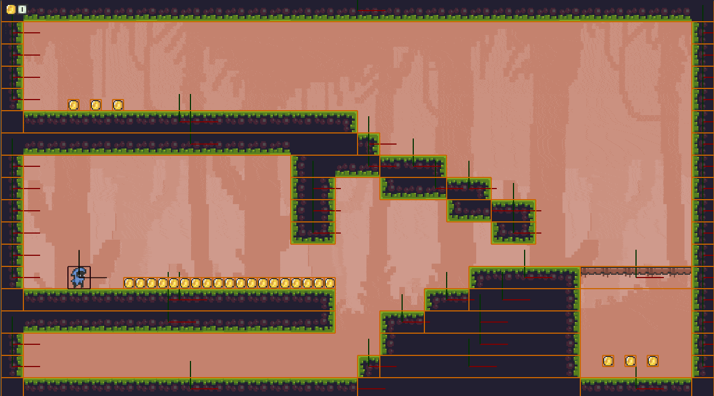
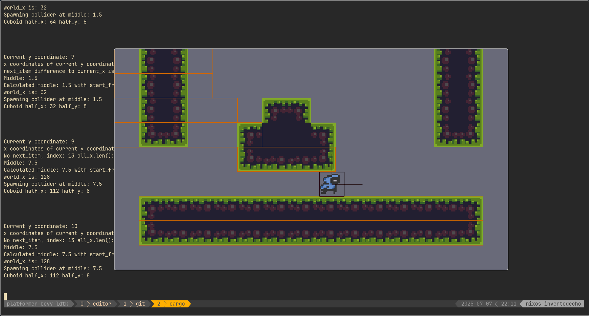
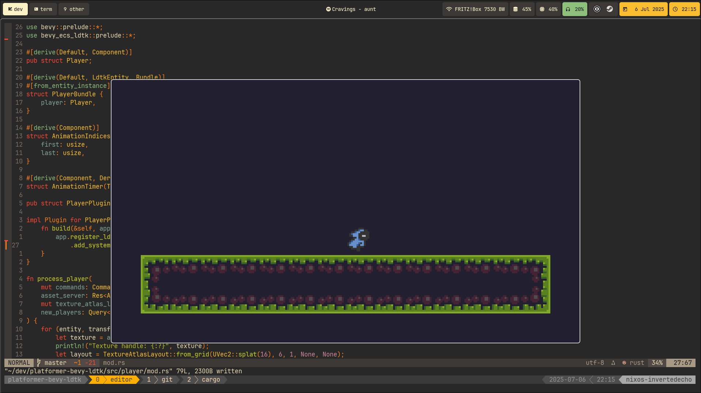

# platformer-bevy-ldtk

My first (proper) game, written with:
- bevy, an ECS rust game engine
- bevy_rapier_2d (rapier physics engine, for bevy)
- bevy_ecs_ldtk (ldtk, which is a level editor, for bevy)

### Progress Screenshots

Here you can see some screenshots what the game looks like throughout the development progress

